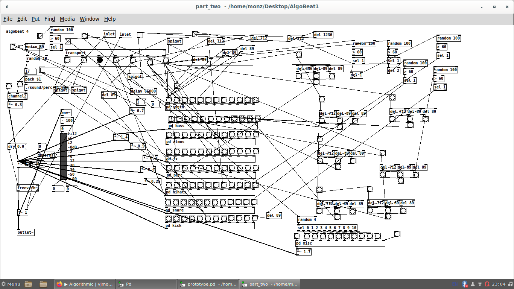

# `m-onz`

full time software engineer/dev in fintech (js. node, not seeking work or opportunities.. recruiters and head hunters please don't contact me). In my spare time I enjoy making music, creative coding, VJ'ing and projection mapping. I like to experiment with algorithmic composition using various tools. I challenged my self to use Pure data to create entire pieces of music instead of using a DAW a few years ago. 

This has lead me to develop and evolve my own algorithmic music and visuals and now I find the idea of making a track in a DAW completely boring now. I used to draw notes in piano rolls and the tracks I made sound like everyone elses. Algorithmic music and visuals is not a new genre... it's a new way of working that opens the door to the future and genuinely original art.

## screenshot

An early algorithmic experiment...

## links

[fakedac~](https://fakedac.net) an event I run focused on AV and algorithmic music & visuals.
[m-onz.net](https://m-onz.net) my personal website
[old bandcamp](https://brainfog.bandcamp.com) non algorithmic music I made before I became enlightened.
